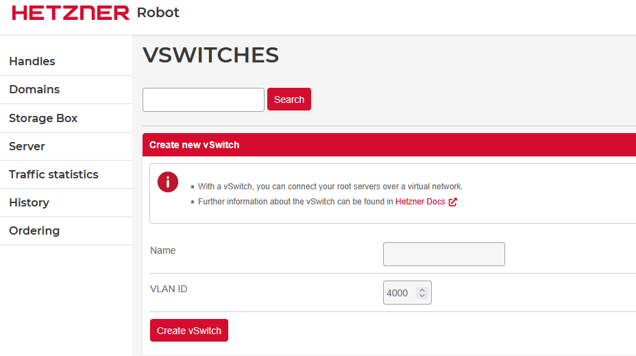
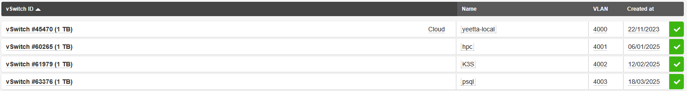
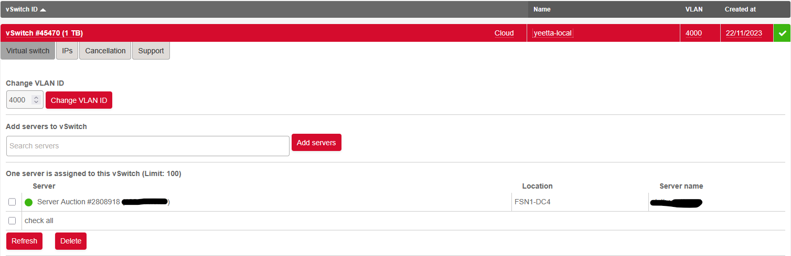

+++
date = '2026-02-13T15:21:01Z'
draft = true
title = 'Connect Hetzner Robot server to Hetzner Cloud'
tags = ['Debian','Hetzner']
+++
# Connect Hetzner Robot server to Hetzner Cloud

> This might be relevant if you have Hetzner Robot servers and Hetzner Cloud services.

Connecting your Hetzner Robot server via a vSwitch to your Hetzner Cloud service is smart for at least two reasons: First you can communicate over private IP#'s and the traffic over the private network is not counted.

### Create a vSwitch on Robot

Goto your Robot console, click Server and you will see on top the vSwitches tab. Direct link [Hetzner vSwitch] https://robot.hetzner.com/vswitch/index. 

Click that and create a vSwitch. Here we assume the default chosen vlan 4000 is used.


When the creating is finished you will get a vSwitch under the ```vSwitch ID``` list.


Open the one you created and it will show something like this, but without any servers connected, of course:

